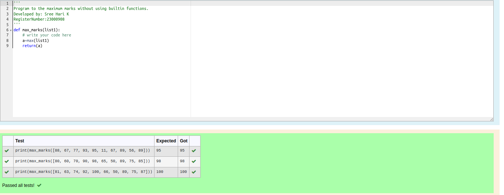

# Find the maximum of a list of numbers
## Aim:
To write a program to find the maximum of a list of numbers.
## Equipment’s required:
1.	Hardware – PCs
2.	Anaconda – Python 3.7 Installation / Moodle-Code Runner
## Algorithm:
1.	Get the list of marks as input
2.	Use the sort() function or max() function or use the for loop to find the maximum mark.
3.	Return the maximum value
## Program:

i)	# To find the maximum of marks using the list method sort.
```Python
''' 
Program to mark the maximum of marks using the list method sort
Developed by:Sree Hari K
RegisterNumber:23000908 
'''
def max_marks(marks):
    #Write your code here
    marks.sort()
    a=marks[-1]
    return a


```

ii)	# To find the maximum marks using the list method max().
```Python
''' 
Program to find the maximum marks using the list method max().
Developed by:Sree Hari K 
RegisterNumber:23000908 
'''
def max_marks(marks):
    # write your code here    
    a=max(marks)
    return(a)

```

iii) # To find the maximum marks without using builtin functions.
```Python
''' 
Program to find the maximum marks using the list method max().
Developed by:Sree Hari K 
RegisterNumber:23000908 
'''
def max_marks(marks):
    # write your code here    
    a=max(marks)
    return(a)


```


## Output:
#### the maximum of marks using the list method sort.

#### To find the maximum marks using the list method max().

#### To find the maximum marks without using builtin functions.



## Result:
Thus the program to find the maximum of given numbers from the list is written and verified using python programming.